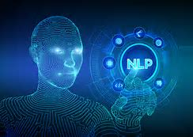
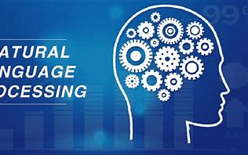

>## *Natural Language Processing - Crypto Sentiment*  
#

 

#

>### Overview: 
>> This script will *leverage* NEWSAPI SDK & *evaluate* sentiment analysis on the Crypto Market

>> *Leveraging the open-source NLTK library*.

 

>## What is Natural Language Processing?
> [Data Science](https://towardsdatascience.com/natural-language-processing-a1496244c15c): Natural Language Processing (NLP) is the technology used to help machines to understand and learn text and language. With NLP data scientists aim to teach machines to understand what is said and written to make sense of the human language. It is used to apply machine learning algorithms to text and speech.
#
>## Natural Language Processing - Use Cases:
> [Data Science](https://www.nltk.org/book/ch00.html): Technologies based on NLP are becoming increasingly widespread. For example, phones and handheld computers support predictive text and handwriting recognition; web search engines give access to information locked up in unstructured text; machine translation allows us to retrieve texts written in Chinese and read them in Spanish; text analysis enables us to detect sentiment in tweets and blogs. By providing more natural human-machine interfaces, and more sophisticated access to stored information, language processing has come to play a central role in the multilingual information society.
>

 

## Resources:
1. Northwestern NPS:
https://sps.northwestern.edu/

2. NLP (Medium):
https://towardsdatascience.com/natural-language-processing-a1496244c15c

3. NLTK:
https://www.nltk.org/book/ch00.html